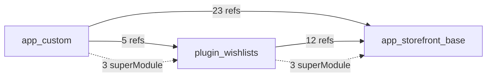

# Resolution Map Schema

解決マップの各セクションのスキーマ定義。assembler エージェントが最終マップを生成する際の契約。

## メタデータ

解決マップの先頭に以下のメタデータを埋め込む:

```yaml
generated_at: "2026-02-06T12:00:00Z"
git_commit: "abc1234"
cartridge_path_source: "dw.json"  # "user_input" | "dw.json" | ".project" | "package.json"
cartridge_path_confidence: "high"  # "high" | "medium" | "low"
cartridge_path: "app_custom:plugin_wishlists:app_storefront_base"
total_files: 245
total_cartridges: 3
```

`cartridge_path_confidence` の判定基準:
- **high**: `dw.json` や Business Manager 設定から直接取得
- **medium**: `package.json` の依存関係やプロジェクト構造から推測
- **low**: ユーザー入力なし、ディレクトリ構造のみから推測

## Section 1: Cartridge Stack

カートリッジの一覧と優先順位。カートリッジパスの左側が最優先。

### スキーマ

| カラム | 型 | 説明 |
|--------|-----|------|
| Order | number | カートリッジパス内の順序（1が最優先） |
| Cartridge | string | カートリッジ名 |
| Type | enum | `base` / `overlay` / `plugin` / `integration` |
| Path | string | ファイルシステム上のパス |
| Files | number | カートリッジ内のファイル数 |

Type 判定: `app_storefront_base`=base, `plugin_*`=plugin, `app_*`(base以外)=overlay, `int_*`=integration

### 例

| Order | Cartridge | Type | Path | Files |
|-------|-----------|------|------|-------|
| 1 | app_custom | overlay | ./cartridges/app_custom | 42 |
| 2 | plugin_wishlists | plugin | ./cartridges/plugin_wishlists | 18 |
| 3 | app_storefront_base | base | ./node_modules/sfra-base/cartridges/app_storefront_base | 185 |

## Section 2: File Resolution Table

各ファイルの解決先マッピング。同じ相対パスが複数カートリッジに存在する場合、カートリッジパスで最初に見つかったものが有効。

### スキーマ

| カラム | 型 | 説明 |
|--------|-----|------|
| Relative Path | string | `cartridge/` からの相対パス |
| Resolves From | string | 実際に解決されるカートリッジ |
| Also In | string[] | 同パスファイルが存在する他カートリッジ |
| SuperModule | string \| null | `module.superModule` の解決先カートリッジ（使用している場合） |
| Line Count | number | ファイルの行数 |

### 例

| Relative Path | Resolves From | Also In | SuperModule | Line Count |
|---------------|---------------|---------|-------------|------------|
| controllers/Cart.js | app_custom | plugin_wishlists, app_storefront_base | plugin_wishlists | 85 |
| controllers/Account.js | app_storefront_base | - | null | 230 |

## Section 3: SuperModule Chains

`module.superModule` の継承チェーン。SFRA コントローラー拡張パターンの核。

### スキーマ

チェーン表記: `app_custom -> plugin_wishlists -> app_storefront_base -> null`

テーブル形式:

| Chain ID | Source | Step 1 | Step 2 | ... | Terminal |
|----------|--------|--------|--------|-----|----------|

### 例

| Chain ID | Source | Step 1 | Step 2 | Terminal |
|----------|--------|--------|--------|----------|
| 1 | app_custom/Cart.js | plugin_wishlists/Cart.js | app_storefront_base/Cart.js | app_storefront_base |

チェーン長 5 段以上は警告マーク付与（パフォーマンスへの影響の可能性）。

## Section 4: Controller Route Map

各コントローラーのルートとミドルウェアチェーン + イベントリスナー。

### Route スキーマ

| カラム | 型 | 説明 |
|--------|-----|------|
| Route | string | Controller-Action 形式（例: `Cart-AddProduct`） |
| HTTP Method | enum | `GET` / `POST` / `USE` |
| Order | number | ミドルウェア実行順序 |
| Cartridge | string | 定義元カートリッジ |
| Method | enum | `base` / `prepend` / `append` / `replace` / `extend` |
| File:Line | string | ファイルパスと行番号 |

実行順序: prepend -> base/replace -> append。extend は新規ルート追加。

### Route の例

| Route | HTTP Method | Order | Cartridge | Method | File:Line |
|-------|------------|-------|-----------|--------|-----------|
| Cart-AddProduct | POST | 1 | app_custom | prepend | controllers/Cart.js:15 |
| Cart-AddProduct | POST | 2 | app_storefront_base | base | controllers/Cart.js:42 |

### Event Listener スキーマ

| カラム | 型 | 説明 |
|--------|-----|------|
| Event | enum | `route:Start` / `route:Step` / `route:Redirect` / `route:BeforeComplete` / `route:Complete` |
| Cartridge | string | リスナー定義元カートリッジ |
| File:Line | string | ファイルパスと行番号 |
| Action | string | リスナーの処理概要 |

## Section 5: Template Override Map

ISML テンプレートの上書き関係。同名テンプレートはカートリッジパス最優先のものが使用される。

### スキーマ

| カラム | 型 | 説明 |
|--------|-----|------|
| Template Path | string | テンプレートの相対パス |
| Provided By | string | 実際に使用されるカートリッジ |
| Overrides | string \| null | 上書きされる元カートリッジ |
| Includes | string[] | このテンプレートが `isinclude` する他テンプレート |

### 例

| Template Path | Provided By | Overrides | Includes |
|---------------|-------------|-----------|----------|
| templates/default/cart/cart.isml | app_custom | app_storefront_base | [miniCart.isml, cartTotals.isml] |

## Section 6: Hook Registration Map

フック定義と登録状況。**重要**: `require('*/...')` とは異なり、Hook は全カートリッジの登録分が**全て実行される**。

> "At run time, B2C Commerce runs all hooks registered for an extension point in all cartridges in your cartridge path."

Hook 定義ファイルの場所は、各カートリッジの `package.json` の `hooks` エントリで決定される。

### スキーマ

| カラム | 型 | 説明 |
|--------|-----|------|
| Hook Name | string | フック名（例: `dw.order.calculate`） |
| Cartridge | string | Hook を定義しているカートリッジ |
| Script | string | 実行スクリプトパス |
| Execution Order | number | カートリッジパス順の実行順序 |
| hooks.json Path | string | `package.json` の `hooks` エントリが指すファイルパス |

### 例

| Hook Name | Cartridge | Script | Execution Order | hooks.json Path |
|-----------|-----------|--------|-----------------|-----------------|
| dw.order.calculate | app_custom | scripts/hooks/cart/calculate.js | 1 | cartridge/hooks.json |
| dw.order.calculate | app_storefront_base | scripts/hooks/cart/calculate.js | 2 | cartridge/hooks.json |

**注意**: 両方の Hook が実行される（カートリッジパス順: app_custom → app_storefront_base）。

## Section 7: Reverse Dependency Index

各ファイルを参照している他ファイルの逆引きインデックス。影響範囲の特定に利用。

### スキーマ

| カラム | 型 | 説明 |
|--------|-----|------|
| File | string | 参照されるファイル |
| Used By | string[] | 参照元ファイル一覧（require / superModule 経由） |
| Ref Type | enum | `wildcard` / `tilde` / `relative` / `dw_api` / `explicit` / `superModule` |

Ref Type: wildcard=`*/cartridge/...`、tilde=`~/cartridge/...`、relative=`./...`、dw_api=`dw/...`、explicit=明示カートリッジ指定、superModule=`module.superModule`参照

## Section 8: Unresolved / Dynamic Resolution

静的に解決できないパターンの一覧。

### スキーマ

| カラム | 型 | 説明 |
|--------|-----|------|
| Pattern | string | 解決できないコード |
| File | string | ファイルパス |
| Line | number | 行番号 |
| Reason | enum | `dynamic_require` / `conditional` / `computed_path` / `unknown` |
| Note | string | 補足情報 |

Reason: dynamic_require=`require(variable)`、conditional=条件分岐内の`require`、computed_path=文字列結合でパス組立、unknown=その他

### 例

| Pattern | File | Line | Reason | Note |
|---------|------|------|--------|------|
| `require('*/cartridge/' + type + '/model')` | controllers/Base.js | 42 | computed_path | type は実行時に決定 |

## Section 9: Dependency Graph Summary

カートリッジ間の依存関係サマリー。

### Mermaid グラフ



実線=require 依存、破線=superModule 関係。

### 統計情報

| Metric | Value |
|--------|-------|
| Total require() calls | number |
| Wildcard requires (`*/`) | number |
| Tilde requires (`~/`) | number |
| SuperModule chains | number |
| Max chain depth | number |
| Unresolved patterns | number |
| Event listeners | number |
| Hook definitions | number |
| Template overrides | number |

---

## scanner 正規化 JSON スキーマ

scanner エージェントが出力する中間表現。resolver と mapper の共通入力。

```json
{
  "cartridges": [
    {
      "name": "string",
      "path": "string",
      "files": [
        {
          "relativePath": "string",
          "type": "controller | model | isml | script | client | config | hook",
          "lineCount": "number",
          "requires": [
            {
              "pattern": "*/cartridge/...",
              "type": "wildcard | tilde | relative | dw_api | explicit",
              "target": "string",
              "line": "number"
            }
          ],
          "superModule": { "used": "boolean", "line": "number" },
          "serverMethods": [
            {
              "method": "get | post | use | append | prepend | replace | extend",
              "routeName": "string",
              "line": "number"
            }
          ],
          "eventListeners": [
            {
              "event": "route:Start | route:Step | route:Redirect | route:BeforeComplete | route:Complete | custom",
              "line": "number",
              "context": "string (optional: surrounding code summary for Action column in Section 4)"
            }
          ],
          "eventEmitters": [
            { "event": "string", "line": "number" }
          ],
          "hookRegistrations": []
        }
      ],
      "hookRegistrations": [
        {
          "name": "string (hook extension point name, e.g. dw.order.calculate)",
          "script": "string (relative script path)",
          "hooksJsonPath": "string (path to hooks.json, from package.json hooks entry)"
        }
      ]
    }
  ],
  "metadata": {
    "generated_at": "ISO 8601",
    "git_commit": "string",
    "cartridge_path": "string",
    "cartridge_path_source": "string",
    "cartridge_path_confidence": "high | medium | low"
  }
}
```

`files[].type` 判定: `controllers/*.js`=controller, `models/**/*.js`=model, `templates/**/*.isml`=isml, `scripts/**/*.js`=script, `client/**/*.js`=client, `config/**/*`=config, `hooks.json`参照先=hook

`requires[].type` 判定: `*/cartridge/...`=wildcard, `~/cartridge/...`=tilde, `./...`=relative, `dw/...`=dw_api, その他=explicit

`hookRegistrations` 取得手順:
1. 各カートリッジの `package.json` から `hooks` エントリを読み取り
2. 指定された JSON ファイルをパースして `hooks[]` 配列を取得
3. 各エントリの `name` と `script` を記録

---

## assembler エージェントへの指示

1. 各 scanner の出力 JSON をマージし、カートリッジパス順にソートする
2. Section 1-9 を順番に生成する
3. 未解決パターン（Section 8）が存在する場合、Section 9 の統計に反映する
4. Mermaid グラフは参照数の多い依存関係を実線、superModule 関係を破線で表現する
5. メタデータの `total_files` と `total_cartridges` は実際の解析結果と一致させる
